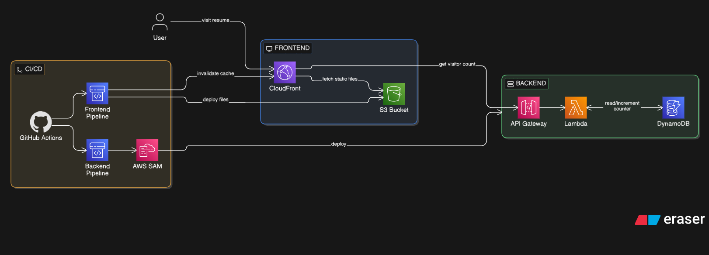

# Cloud Resume Challenge

[The Cloud Resume Challenge](https://cloudresumechallenge.dev/docs/the-challenge/) attempted and completed.

## Architecture

## Repos
| Part | Repo | Description |
|------|------|-------------|
| Frontend | [cloud-resume-frontend](https://github.com/hassanamran/cloudResume-frontend) | S3 + CloudFront + GitHub Actions |
| Backend | [cloud-resume-backend](https://github.com/hassanamran/cloudResume-backend) | Lambda + DynamoDB + API Gateway + SAM |

## What I Built
A resume site that's fully serverless and self-updating.
The frontend sits on S3 acting as a static site host
and is served through CloudFront.
There's a visitor counter on the page that's backed by 
Lambda and DynamoDB. Both the frontend and backend deploy 
automatically whenever I push to GitHub.
To view the IAC or any other material used in the infrastructure
head over to the repos linked above.

## Problems Faced Along the Way
Although the initial infrastructure was easy to set up through
the AWS console, the difficulty spiked when IaC was introduced.
Writing and learning SAM for the first time was a challenge in itself.
The hardest part was debugging the automation through GitHub Actions.
Several workflow runs failed — especially on the backend repo — and
identifying what each error meant and how to fix it was quite difficult.

## Live Site
[dpyz12c4xfwzb.cloudfront.net](https://dpyz12c4xfwzb.cloudfront.net)
